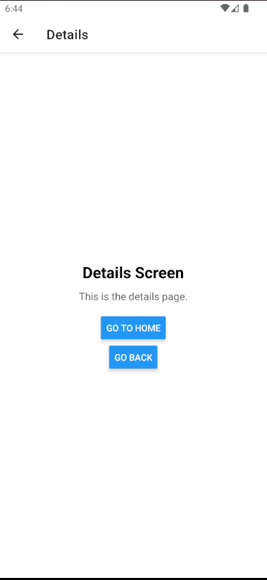
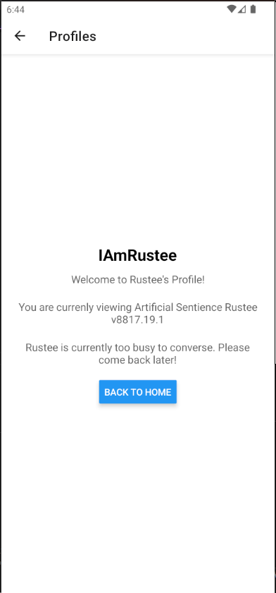

# React Native Navigation Lab Activity

A React Native application demonstrating stack navigation using React Navigation and Expo.

## Student Information

- **Name:** Delwin P. Vidallon
- **Student ID:** 202302248
- **Course:** Mobile Application Development
- **Date:** 02/12/2025

## Features

- Stack navigation between screens
- Home and Details screens
- Navigation buttons and gestures
- Android emulator support

## Technologies Used

- React Native 0.76.3
- Expo ~52.0.0
- React Navigation 6.x
- JavaScript/ES6

## Installation

\`\`\`bash
npm install
\`\`\`

## Running the App

\`\`\`bash

# Start development server

npm start

# Run on Android

npm run android

# Run on iOS

npm run ios

# Run on web

npm run web
\`\`\`

## Project Structure

\`\`\`
├── App.js # Main app with navigation
├── screens/
│ ├── HomeScreen.js # Home screen
│ └── DetailsScreen.js # Details screen
├── package.json # Dependencies
├── app.json # Expo configuration
└── README.md # Documentation
\`\`\`

## Screenshots

## Challenges Faced

Adding a new page was kind of a challenge. I just forgot to add it to the main file App.js

## Learning Outcomes

I learned the basics of react applications. Maybe next time I should be able to add something more complex to my future react applications haha.

## References

- [React Navigation Documentation](https://reactnavigation.org/)
- [Expo Documentation](https://docs.expo.dev/)
- [React Native Documentation](https://reactnative.dev/)
